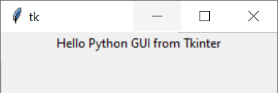
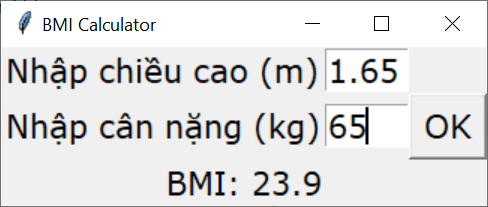

# Tạo ứng dụng GUI với Tkinter

Python GUI development

---

## Giới thiệu

Có nhiều thư viện GUI cho Python, trong đó Tkinter là thư viện chuẩn và được sử dụng rộng rãi. Các ưu điểm của Tkinter bao gồm hỗ trợ đa nền tảng (cross-platform: hoạt động tốt trên Windows, macOS và Linux) và gọn nhẹ.

## Tạo ứng dụng GUI đầu tiên

Thành phần cơ bản của ứng dụng GUI là cửa sổ - là đối tượng chứa mọi thành phần giao diện đồ họa của ứng dụng, như nút lệnh, hộp văn bản, nhãn, v.v.. gọi là widgets.

```python
# Khai báo lớp tkinter 
import tkinter as tk
# Tạo cửa sổ
window = tk.Tk()
# Thêm nhãn chứa câu 'Hello Python GUI from Tkinter'
greeting = tk.Label(text="Hello, Tkinter")
# Đưa nhãn vào window:
greeting.pack()
# Chạy Tkinter event loop
window.mainloop()
```



## Làm việc với các Widgets

Widgets là các đối tượng giao tiếp đồ họa với người dùng. Tkinter xây dựng mỗi widget dưới dạng lớp đối tượng.

| Widget Class  | Description |
| ------------- | ------------- |
| Label	        | A widget used to display text on the screen |
| Button 	    | A button that can contain text and can perform an action when clicked |
| Entry	        | A text entry widget that allows only a single line of text |
| Text	        | A text entry widget that allows multiline text entry |
| Frame	        | A rectangular region used to group related widgets or provide padding between widgets |

- Một ứng dụng phức tạp hơn: BMI calculator

```python
from tkinter import *


def bmi_calculate():
    height = float(h_entry.get())   # lấy dữ liệu từ đối tượng lớp Entry -> chuyển kiểu float
    weight = float(w_entry.get())
    bmi = weight/(height**2)        # tính BMI
    output_label.configure(text='BMI: {:.1f}'.format(bmi))  # Xuất kết quả

# Khởi tạo cửa sổ ứng dụng
root = Tk()
root.title('BMI Calculator')

# Tạo các nhãn (label) trong cửa sổ
h_message_label = Label(text='Nhập chiều cao (m)',
                        font=('Verdana', 16))
w_message_label = Label(text='Nhập cân nặng (kg)',
                        font=('Verdana', 16))
output_label = Label(font=('Verdana', 16))

# Tạo textbox nhập liệu
h_entry = Entry(font=('Verdana', 16), width=4)
w_entry = Entry(font=('Verdana', 16), width=4)

# Tạo nút lệnh (button)
calc_button = Button(text='Tính', font=('Verdana', 16),
                     command=bmi_calculate)

# Sắp xếp vị trí các đối tượng đồ họa
h_message_label.grid(row=0, column=0)
w_message_label.grid(row=1, column=0)
h_entry.grid(row=0, column=1)
w_entry.grid(row=1, column=1)
calc_button.grid(row=0, column=2, rowspan=2)
output_label.grid(row=2, column=0, columnspan=3)

# Chạy Tkinter event loop
mainloop()
```



