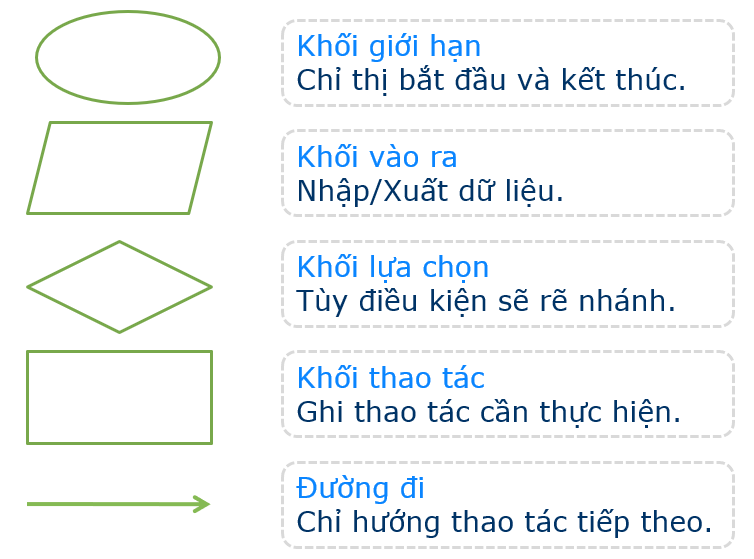
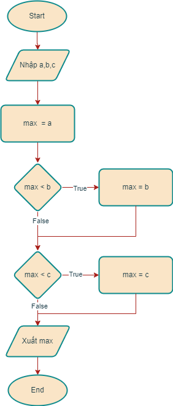

# Các khái niệm cơ bản về lập trình

Overview

---

## Máy tính, chương trình và lập trình

### Sơ lược về máy tính điện tử

- Máy tính điện tử (electronic computer) là thiết bị điện tử có khả năng xử lý thông tin tự động theo chương trình lập sẵn.
- Máy tính điện tử ngày nay được chế tạo theo [kiến trúc Von Neumann](https://en.wikipedia.org/wiki/Von_Neumann_architecture).

[](https://en.wikipedia.org/wiki/Von_Neumann_architecture#/media/File:Von_Neumann_Architecture.svg)

- Các thành phần chính của máy tính điện tử:
    - Bộ xử lý trung tâm (central processing unit) có chức năng điều khiển, thực hiện các tính toán số học và logic.
    - Bộ nhớ (memory) lưu trữ dữ liệu (data) và chương trình (programs).
    - Thiết bị nhập (input devices) nạp dữ liệu hoặc lệnh vào cho máy tính xử lý.
    - Thiết bị xuất (output devices) đưa kết quả xử lý ra.

### Đặc điểm cơ bản của máy tính điện tử

- Máy tính hoạt động (xử lý dữ liệu) theo chương trình lập sẵn.
- Máy tính điện tử chỉ xử lý được các lệnh và dữ liệu được biểu diễn dưới dạng mã nhị phân (gọi là mã máy).
- Tốc độ xử lý của máy tính rất nhanh (hàng tỷ phép tính/giây).

## Giải thuật và lập trình

### Giải quyết bài toán bằng máy tính
- Khi cần giải quyết một bài toán, máy tính không tự nghĩ ra cách giải, mà con người cần xây dựng một dãy các lệnh theo trật tự xác định để máy tính thực hiện xử lý. Tập các lệnh được gọi là chương trình (program).
- Để giải quyết một bài toán bằng máy tính, con người cần thực hiện các bước cơ bản sau:
    - Phân tích bài toán, xác định yêu cầu: dữ kiện bài toán (input), kết quả cần tìm kiếm/tính toán (output);
    - Xây dựng giải thuật/thuật toán (algorithm): Vận dụng kiến thức liên quan để xây dựng dãy các hành động theo một thứ tự xác định để giải quyết bài toán;
    - Viết chương trình (programming/coding): Sử dụng ngôn ngữ lập trình phù hợp để cài đặt giải thuật thành chương trình máy tính.

### Giải thuật
- Giải thuật hay thuật toán (algorithm) là một dãy hữu hạn các hành động được định nghĩa rõ ràng nhằm giải quyết một bài toán cụ thể.
- Giải thuật phải thỏa mãn các tính chất sau:
    - Đúng (correctness): Kết quả của giải thuật phải chính xác.
    - Rõ ràng (unambiguous): Các bước xử lý của giải thuật phải xác định.
    - Phổ quát (generality): Giải thuật cần giải được một lớp bài toán có đầu vào tương tự nhau.
    - Hữu hạn (finite): Giải thuật phải kết thúc sau một số hữu hạn bước xử lý.

### Biểu diễn giải thuật
#### Sử dụng ngôn ngữ tự nhiên
- Ví dụ: Nhập ba số nguyên bất kỳ, tìm số lớn nhất.
    - *Input*: 3 số nguyên bất kỳ
    - *Output*: số lớn nhất trong 3 số vừa nhập

    - **Bước 1**: Nhập 3 số nguyên a,b,c
    - **Bước 2**: Khởi tạo giá trị max =  a
    - **Bước 3**: So sánh max với b, nếu max < b thì gán max = b
    - **Bước 4**: So sánh max với c, nếu max < c thì gán max = c
    - **Bước 5**: In ra giá trị số max
    - **Bước 6**: Kết thúc

#### Sử dụng lưu đồ (flowchart)
- Lưu đồ sử dụng các biểu tượng hình học để biểu diễn giải thuật.

- Ví dụ: Nhập ba số nguyên bất kỳ, tìm số lớn nhất.
    - *Input*: 3 số nguyên bất kỳ
    - *Output*: số lớn nhất trong 3 số vừa nhập



### Lập trình
- Là hoạt động thực hành cài đặt giải thuật trừu tượng thành chương trình máy tính bằng cách sử dụng một ngôn ngữ lập trình.
- Ví dụ: Cài đặt giải thuật tìm số lớn nhất trong 3 số nguyên bằng ngôn ngữ lập trình Python:

Chương trình nguồn (source code):
```Python
# find_max_number.py
# Chương trình thực hiện: Đọc 3 số nguyên từ bàn phím. Tìm và in ra số lớn nhất.

# Nhập dữ liệu
a = int(input('Nhập số nguyên a = '))
b = int(input('Nhập số nguyên b = '))
c = int(input('Nhập số nguyên c = '))

# Tìm số lớn nhất trong a,b,c. Sử dụng kỹ thuật 'đặt lính canh'
max_number = a
if max_number < b: max_number = b
if max_number < c: max_number = c

# In kết quả xử lý
print("Số lớn nhất là {}".format(max_number))
```
Kết quả chạy chương trình:


https://github.com/nd-hung/python-programming/blob/c8e2379bd709677cbc988f7cb1169d99fa0807dc/docs/topics/overview/code/find_max_number.py#L1

Ngôn ngữ lập trình

- Ngôn ngữ lập trình là loại phần mềm chuyên dụng dùng để tạo ra các chương trình máy tính. Một ngôn ngữ lập trình cung cấp các khai báo dữ liệu và các câu lệnh điều khiển, đồng thời có chức năng dịch các dòng lệnh thành ngôn ngữ máy để máy tính thi hành được.

### Các loại ngôn ngữ lập trình

- Ngôn ngữ máy ()

### Môi trường phát triển tích hợp (IDE)

### Ngôn ngữ lập trình Python

Ngày nay, Python là một trong những ngôn ngữ lập trình được sử dụng rộng rãi nhất trên thế giới. Các ưu điểm nổi bật của Python là:

- Python là ngôn ngữ thông dịch, hướng đối tượng.
- Python có cú pháp đơn giản, dễ hiểu. Chương trình Python dễ bảo trì, nâng cấp.
- Python hoạt động trên đa nền tảng: Windows, Linux và Mac.
- Khả năng mở rộng dễ dàng.

### Các ứng dụng của Python

Là ngôn ngữ lập trình đa dụng, Python được sử dụng rộng rãi trong nhiều lĩnh vực:

#### Lập trình hệ thống (system programming)

- Python cung cấp các thư viện dựng sẵn cho phép tạo các ứng dụng hệ thống gọn nhẹ, dễ bảo trì. Các loại ứng dụng bao gồm xử lý file, xử lý song song v.v..

#### Tạo ứng dụng GUI

- Python cung cấp giao tiếp chuẩn, hướng đối tượng liên kết đến thư viện đồ họa Tk GUI API (gọi là tkinter), cho khả năng tạo các ứng dụng GUI nhanh chóng. Một số thư viện khác gồm PyQt, PyGTK.

#### Lập trình ứng dụng Web/Internet

- Python cung cấp công cụ lập trình socket, truyền dữ liệu qua mạng,xử lý tài liệu XML, JSON, xử lý email, v.v..
Ngoài ra, có nhiều công cụ được phát triển bởi bên thứ 3 như Django, web2py.

#### Lập trình cơ sở dữ liệu

- Python cung cấp giao tiếp kết nối với các hệ quản trị cơ cơ sở dữ liệu quan hệ phổ biến như Oracle.

#### Lập trình xử lý bài toán khoa học

Python ngày nay được sử dụng trong các bài toán khoa học kỹ thuật, với các thư viện xử lý số rất mạnh như NumPy, SciPy.

#### Lập trình ứng dụng khoa học dữ liệu, trí tuệ nhân tạo, IoT

### Cơ chế hoạt động của Python

- Ngôn ngữ Python hoạt động theo cơ chế thông dịch.
