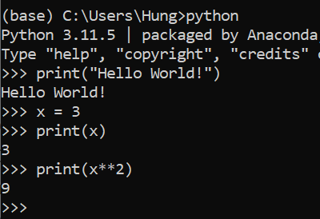

# Python cơ bản

Python Basics

---

## Hello, World

<script type="text/javascript" src="//cdn.datacamp.com/dcl-react.js.gz">  
</script>

<div data-datacamp-exercise data-lang="python" data-height="5">
  <code data-type="sample-code">
    # Chương trình đầu tiên: In ra màn hình câu "Hello, World!"
    print("Hello, World!")
  </code>
</div>

## Thực thi chương trình Python

### Chạy từng dòng lệnh

Các bước thực hiện:

- Mở cửa sổ chế độ dòng lệnh (terminal).
- Nhập `python` (hoặc `python3`) và nhấn `Enter` để mở Python chế độ tương tác.
- Nhập từng dòng lệnh để thực thi.

Ví dụ:



### Chạy file mã nguồn từ chế độ dòng lệnh

- Mở cửa sổ dòng lệnh (terminal).
- Nhập `python <[path_to/]python_script_file_name.py>` và nhấn `Enter` để thực thi. Trình thông dịch sẽ lần lượt thực hiện các lệnh trong file mã nguồn.

### Thực thi chương trình Python từ môi trường phát triển tích hợp (IDE)

- Mở IDE lập trình Python ưa thích (PyCharm, VS Code, Spyder, IDLE,...).
- Tạo (hoặc mở) file chương trình Python.
- Nhấn lệnh `Run` để thực thi chương trình.

## Biến và kiểu dữ liệu

Mọi biến trong Python đều là đối tượng, không cần phải khai báo biến trước khi sử dụng.
Kiểu dữ liệu của một biến được xác định khi gán giá trị cho nó.

Python có các kiểu dữ liệu cơ sở sau:

### Kiểu chuỗi (text)

Chuỗi là dãy ký tự đặt trong cặp dấu nháy kép "" hoặc nháy đơn ''.

Ví dụ:
<div data-datacamp-exercise data-lang="python" data-height="50">
<code data-type="sample-code">
    # Dạng chuỗi 1: đặt giữa cặp dấu nháy kép
    ntu_slogan1 = "Lựa chọn đúng để thành công!"
    print(ntu_slogan1)

    # Dạng chuỗi 2: đặt giữa cặp dấu nháy đơn
    ntu_slogan2 = 'Căng buồm tri thức vươn khơi.'
    print(ntu_slogan2)

    # Dạng chuỗi 3: chuỗi gồm nhiều dòng
    verses = """
    'Trải qua một cuộc bể dâu
    Những điều trông thấy mà đau đớn lòng.'
    \t\t- trích Truyện Kiều (Nguyễn Du)
    """
    print(verses)
  </code>
</div>

### Kiểu số (numeric)

Python có các kiểu số nguyên (int), số thực (float) và số phức (complex).

Ví dụ:

<div data-datacamp-exercise data-lang="python" data-height="50">
    <code data-type="sample-code">
        # Kiểu số nguyên
        n = 3721
        print("n = %d" % n)

        # Kiểu số thực
        pi = 3.14159
        print("PI = %.2f" % pi)

        # Số phức
        z = 3 + 5j
        print("z = ", z)
  </code>
</div>

### Kiểu tuần tự (sequence)

- Kiểu danh sách (sequence): list, tuple, range
- Kiểu từ điển (mapping): dict
- Kiểu tập hợp (set): set, frozenset

### Kiểu Boolean: bool
Kiểu bool có giá trị `True` hoặc `False`.

Ví dụ:

<div data-datacamp-exercise data-lang="python" data-height="50">
    <code data-type="sample-code">
        fruits = {'bưởi', 'táo', 'đu đủ', 'cam'}

        is_apple_in_fruits = 'táo' in fruits
        print(is_apple_in_fruits)

        is_durian_in_fruits = 'durian' in fruits
        print(is_durian_in_fruits)  
    </code>
</div>

### Kiểu None (NoneType)

Kiểu dữ liệu `None` dùng để chỉ một biến hoặc đối tượng không có giá trị.

!!! NOTE
    Dùng hàm `type()` để lấy kiểu dữ liệu của một biến hoặc biểu thức.

Ví dụ:

<div data-datacamp-exercise data-lang="python" data-height="100">

  <code data-type="sample-code">

    n = 3721
    print("Kiểu dữ liệu là ", type(n).__name__)

    PI = 3.1416
    print("Kiểu dữ liệu là ", type(PI).__name__)
    
    four_seasons = ['Xuân', 'Hạ', 'Thu', 'Đông']
    print("Kiểu dữ liệu là ", type(four_seasons).__name__)

    fruits = {"bưởi", "táo", "cam", "chanh"}
    print("Kiểu dữ liệu là ", type(fruits).__name__)

    student_info = {'ID':'65131234', 'grades':{'python':8.5, 'maths':7.8}}
    print("Kiểu dữ liệu là ", type(student_info).__name__)

    numbers = (3,7,2,1)
    print("Kiểu dữ liệu là ", type(numbers).__name__)

    greeting_message = 'Welcome to Nha Trang!'
    print("Kiểu dữ liệu là ", type(greeting_message).__name__)
</div>
## Biến, biểu thức, câu lệnh

### Biến (variables)

- Biến là đối tượng dùng để lưu dữ liệu.
- Giá trị của biến có thể thay đổi khi chương trình hoạt động.
- Python không có lệnh khai báo biến, biến được tạo ra khi gán giá trị cho nó.

Cú pháp khởi tạo biến:

```Python
<variable_name> = <value>
<variable_name1>, <variable_name2> = <value1>,<value2>
```

Trong đó:

- Tên biến: đặt theo quy định sau:
  - Tên biến chỉ gồm các ký tự chữ cái, chữ số và dấu gạch dưới '_'.
  - Tên biến phải bắt đầu bằng chữ cái hoặc ký tự gạch dưới.
  - Không được đặt tên biến trùng với [từ khóa của Python](https://docs.python.org/3/reference/lexical_analysis.html#keywords).

Ví dụ:

- Tên biến hợp lệ: `delta`, `x1`, `don_gia`, `_123abc`

- Tên biến không hợp lệ:

    `3VanChinNghin`: bắt đầu bằng chữ số

    `Don Gia`: chứa khoảng trắng

    `except`: trùng với từ khóa của Python

!!! Note

- Ngôn ngữ Python phân biệt chữ hoa chữ thường (case-sensitive), nên các tên sau là khác nhau: `TinHoc`, `Tinhoc`, `tinHoc`.
- Nên đặt tên biến ngắn gọn, có nghĩa (diễn tả nội dung nó chứa). Ví dụ, để viết lệnh tính quãng đường đi dựa vào vận tốc và thời gian, thay vì viết `d = v*t`, nên viết `distance = velocity * traveled_time` hoặc `quang_duong = van_toc * thoi_gian`, sẽ giúp câu lệnh dễ hiểu hơn.
- Với Python 3, có thể đặt tên biến bằng ký tự Unicode (gồm cả tiếng Việt), chẳng hạn: `Ba_Vạn_Chín_Nghìn = 39000` là một khai báo hợp lệ. Tuy nhiên, chỉ nên đặt tên biến bằng các ký tự ASCII.

Một số ví dụ về khởi tạo biến với Python:
  
<div data-datacamp-exercise data-lang="python" data-height="200">
  <code data-type="sample-code">
    # Khai báo biến n và gán số nguyên cho nó
    n = 3721
    print("n = ", n)

  </code>
</div>

## Các câu lệnh điều khiển

## Lệnh rẽ nhánh if

### Dạng 1: Lệnh if thiếu

- Nếu `<BT logic>` có giá trị đúng (True) thì thực hiện `<Lệnh đơn>` hoặc `<Khối lệnh>`

```python
if <BT logic>: <Lệnh đơn>
hoặc
if <BT logic>: 
    <Khối lệnh>
```

Ví dụ:

```python
n = 5
if n % 2 != 0: print(f'{n} là số lẻ.')
m = 69
if m > 0:
    print(f'm = {m}')
    print(f'{m} là số dương.')
```

### Dạng 2: Lệnh if đủ

- Nếu `<BT logic>` có giá trị đúng (True) thì thực hiện `<Khối lệnh 1>`, ngược lại thực hiện `<Khối lệnh 2>`

```python
if <BT logic>: 
    <Khối lệnh 1>
else:
    <Khối lệnh 2>
```

Hoặc viết gọn hơn khi chỉ có lệnh đơn:

```python
<Lệnh 1> if <BT logic> else <Lệnh 2>
```

Ví dụ:

```python
n = 5
if n % 2 != 0: 
    print(f'{n} là số lẻ.')
else:
    print(f'{n} là số chẵn.')

a, b = 6, 9
print(f'{a} > {b}') if a > b else print(f'{b} > {a}')    
```

### elif

- Trong lệnh if, muốn kiểm tra điều kiện mới khi điều kiện trước không thỏa mãn thì dùng từ khóa `elif`

```python
if <BT logic 1>:        
    <Khối lệnh 1>
elif <BT logic 2>:
    <Khối lệnh 2>
    ...
elif <BT logic n>:
    <Khối lệnh n>
else:
    <Khối lệnh n+1>
```

## Lệnh lặp

### Lệnh lặp while

- Lệnh lặp `while` lặp lại khối lệnh chừng nào `BT điều kiện` còn đúng.

```python
while <BT điều kiện>:
    <Khối lệnh>
```

Ví dụ: Tính tổng các chữ số của số tự nhiên n:

```
n = 123
sum_digits = 0
while n > 0:
    sum_digits += n % 10
    n = n // 10
print(f'Tổng chữ số = {sum_digits}')
```

#### Lệnh break

- Lệnh `break' khi được gọi sẽ dừng vòng lặp.
- Trong ví dụ sau, dù điều kiện lặp là `i < 100`, nhưng nếu i bằng 5 thì dừng vòng lặp, nên chương trình chỉ in ra các số nguyên liên tiếp từ 1 đến 4.

```python
i = 1
while i < 100:
    print(i, end= ' ')
    i += 1
    if i == 5: break
```

#### Lệnh continue

- Lệnh `continue' khi được gọi sẽ chuyển sang vòng lặp kế tiếp.
- Trong ví dụ sau, biến i khởi đầu bằng 0, chừng nào i còn thỏa `< 10` thì tăng i thêm 1 và in ra giá trị của i, nhưng nếu i là số chẵn thì lệnh `continue` được gọi, chương trình chuyển sang xử lý bước lặp tiếp theo mà bỏ qua lệnh `print(i, end=' ')`. Kết quả là chương trình chỉ in ra các số lẻ từ 1 đến 9.

```python
i = 0
while i < 10:
    i += 1
    if i % 2 == 0: continue
    print(i, end= ' ')
```

### Lệnh lặp for

- Lệnh lặp `for` dùng để duyệt từng phần tử trong một dãy (list, tuple, dictionary, set, string).

#### Duyệt danh sách

- Cú pháp

```python
for <biến chạy> in <danh sách>:
    <Khối lệnh>
```

- Ví dụ

```python
Tứ_Linh = ['Long', 'Ly', 'Quy', 'Phượng']
# Cách 1: duyệt từng phần tử của danh sách
for tl in Tứ_Linh:
    print(tl, end=' ')
# Cách 2: duyệt từng phần tử thông qua vị trí trong danh sách    
for i in range(len(Tứ_Linh)):
    print(Tứ_Linh[i], end=' ')
```

#### Duyệt chuỗi ký tự

- Chuỗi là một dãy ký tự vì thế có thể duyệt từng ký tự của chuỗi bằng lệnh for.
- Cú pháp

```python
for ch in <chuỗi>:
    <Lệnh>
```

- Ví dụ

```python
st = 'Nha Trang Khánh Hòa'
for ch in st:
    print(ch) 
```

#### Hàm range()

- hàm `range(<start_value>, <end_value>, <step>)` thường được kết hợp khi muốn thực hiện lệnh lặp với số bước lặp xác định.
- Ví dụ: In 10 dòng 'Hello world'

```python
for i in range(10): # range(0, 10, 1)
    print('Hello world')
```

### Lệnh lặp lồng nhau (nested loop)

- Lệnh lặp lồng nhau: Trong một lệnh lặp chứa lệnh lặp khác.
- Với mỗi bước lặp của vòng lặp ngoài, lệnh lặp bên trong sẽ thực hiện hết một lượt.
- Ví dụ: In bảng cửu chương

```python
for i in range(2, 10):
    for j in range(1, 11):
        print('%3d x %3d = %3d'  % (i, j, i*j))
```
